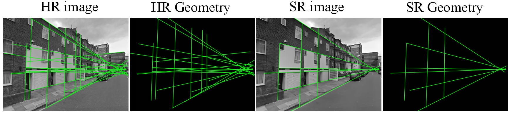

# City Scene Super-Resolution via Geometric Error Minimization

#PROMPT

python main.py -m unet -uf 2 -lr 0.001 -n 300

-b [batchSize]	
-t [testBatchSize]	
-seed [random seed]	
-m [model] 	
-uf [upscale_factor]	
-lr [learning rate]	
-n [epochs]	

-m [model] 	

GeoSR--->GeoSR

SimUnet--->simunet	

ESPCN--->sub	

SRCNN--->srcnn	

VDSR--->vdsr	

EDSR--->edsr	

FSRCNN--->fsrcnn	

DRCN--->drcn	

SRGAN--->srgan	

Bicubic--->bi	
